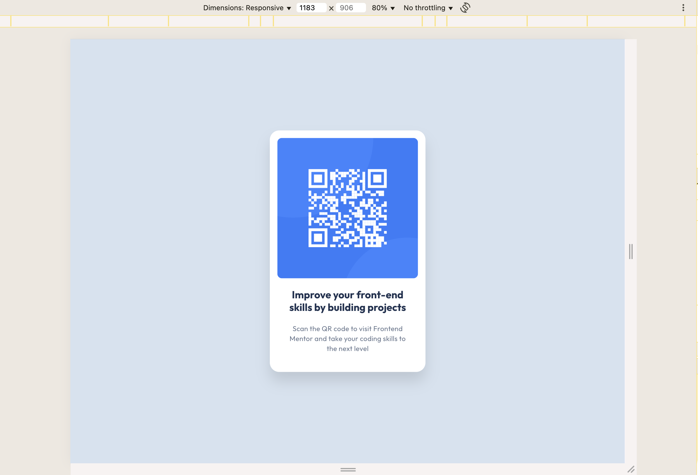
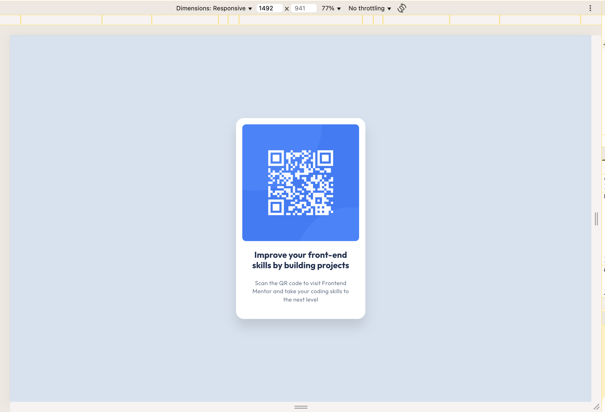
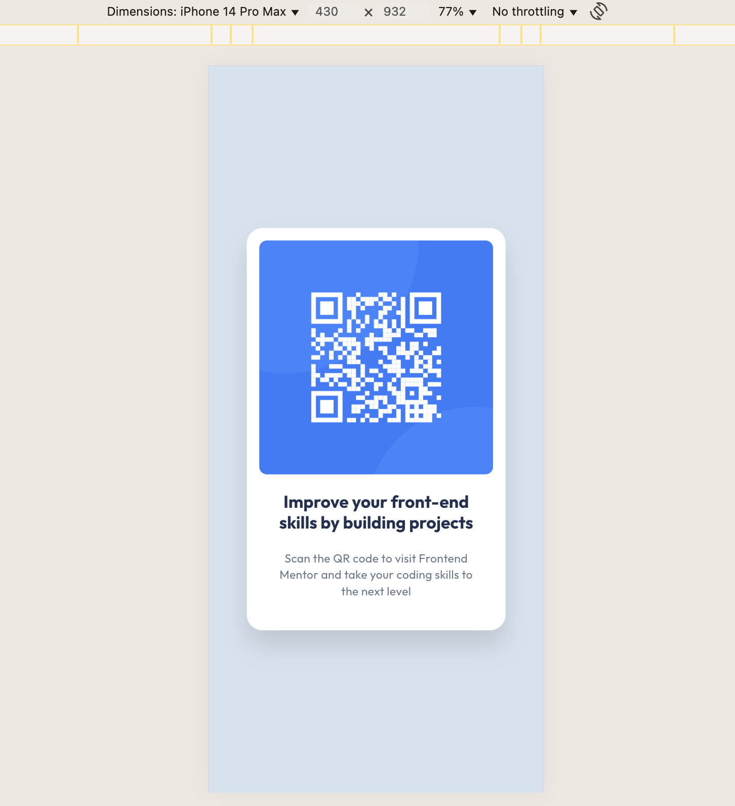

# Frontend Mentor - QR code component solution

This is a solution to the [QR code component challenge on Frontend Mentor](https://www.frontendmentor.io/challenges/qr-code-component-iux_sIO_H). Frontend Mentor challenges help you improve your coding skills by building realistic projects.

## Table of contents

- [Overview](#overview)
  - [Screenshot](#screenshot)
  - [Links](#links)
- [My process](#my-process)
  - [Built with](#built-with)
  - [What I learned](#what-i-learned)
  - [Continued development](#continued-development)
  - [Useful resources](#useful-resources)
- [Author](#author)
- [Acknowledgments](#acknowledgments)

## Overview

The goal of this challenge was to build a QR code component that looks as close as possible to the given Figma design. The project focuses on practicing layout fundamentals (centering, padding, gaps), styling consistency (colors, shadows, border-radius), and handling assets correctly in a React/Vite environment. Although simple, it’s a great exercise for paying attention to detail.

### Screenshot

Website:





Mobile:



### Links

- Solution URL: [Add solution URL here](https://your-solution-url.com)
- Live Site URL: [Add live site URL here](https://your-live-site-url.com)

## My process

I started by breaking down the Figma design into a simple skeleton structure using semantic HTML elements (`img`, `h1`, `p`). Then I wrapped everything in a `card` container and focused on centering it on the page using flexbox on the `<body>`. Once the skeleton was in place, I added CSS step by step: background color, card box with padding and shadow, styling the QR image with rounded corners, and finally typography for the heading and description. I continuously compared the result against the design to refine spacing, alignment, and color accuracy. I also cleaned up unused Vite template code to keep the project lightweight and focused.

### Built with

- Semantic HTML5 markup
- CSS (custom properties, flexbox, shadows, responsive units)
- [React](https://reactjs.org/) – JS library
- [Vite](https://vitejs.dev/) – Build tool
- Mobile-first workflow

**Note: These are just examples. Delete this note and replace the list above with your own choices**

### What I learned

Use this section to recap over some of your major learnings while working through this project. Writing these out and providing code samples of areas you want to highlight is a great way to reinforce your own knowledge.

To see how you can add code snippets, see below:

This project helped me practice translating **Figma specs into CSS**. For example, the design used auto-layout with padding `16px 16px 40px 16px` and a gap of `24px`, which directly translated into:

```css
.card {
	display: flex;
	flex-direction: column;
	padding: 16px 16px 40px 16px;
	gap: 24px;
	border-radius: 20px;
}
```

### Useful resources

- [CSS Tricks - Flexbox Guide](https://css-tricks.com/snippets/css/a-guide-to-flexbox/) - T– Helped me refine flexbox centering.

## Author

- Frontend Mentor - [@Jayashree-Kulothungan](https://www.frontendmentor.io/profile/Jayashree-Kulothungan)
